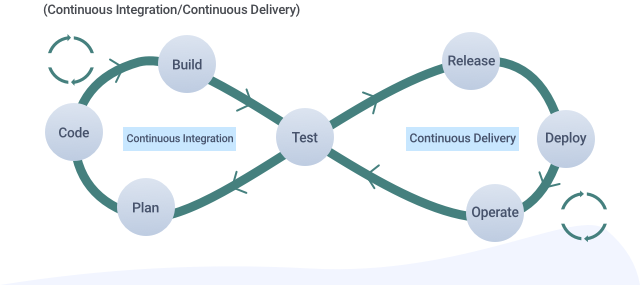

<!-- _class: default -->
# Full Stack Engineering

From entry to ~~mastery~~ quitting

---

## The Text Book

<!-- _class: default -->

---

## Full Stack

---

### Popular Stacks

* MEAN - MongoDB + Express + Angular + Node.js
* MERN - MongoDB + Express + React + Node.js
* Django - Django + Python + MySQL

---

### Node.js

A JavaScript runtime built one Chrome's V8 JavaScript engine

---

### Node.js (cont'd)

* Cross-platform
* Language
  * JavaScript (ECMAScript)
  * TypeScript

---

### Node.js (cont'd)

* Package system
  * Manifest (`package.json`)
    * Dependency
    * Makefile
  * `node_moudules`
  * Package manager (npm, yarn === pip)
  * ~1,894,242 packages on npmjs.com

---

## DevOps

A crash course

---

### CI/CD

---

### CI/CD Pipeline

* Continouse Integration
  * Merge regularily into a centeral repo
  * Automated Builds/Tests
* Continouse Delivery
  * Automatically depoly code changes

---

---

## Lab 1 :lab_coat:

* Setup Node.js environment
  * Yarn
  * nvm (=== pyenv, optional)
* Demo 1: Simple HTTP Service
* Demo 2: Next.js

---

## Starter Project: Build A Blog Site

* Basic DevOps
  * Build
  * Deploy
  * Operate
* Frontend Playground
  * Custom Theming

---

### Static Vs Dynamic

* Dynamic Site
  * Dynamically generated (express.js, PHP)
  * :+1: Powerful
  * :-1: Costs (server) & harder to learn

* Static Site (HTML + CSS + JS + Assets) :heavy_check_mark:
  * No backend (statically generated at build time)
  * Delivered as stored
  * :+1: Cheap (free hosting options) & easy to learn
  * :-1: Limited in features
---

### Toolchain Options
* Static site generator 
  * Compile Markdown -> HTML/JS/CSS
    * Jekyll
    * Hexo :heavy_check_mark:
  * :+1: Ease of use
  * :-1: Limited in power

---

### Toolchain Options
* Custom Build
  * Frameworks
    * CRA
    * Next.js
  * :+1: Powerful
  * :-1: More learning

--- 

### Hosting

Deploy to public servers ([GitHub Pages](https://pages.github.com) for free)

---

---

### GitHub Pages

* Structure
  * Per user `username.github.io` -> `master`
    * http://username.github.io
  * Per project `project_a` -> `gh-pages`
    * http://username.github.io/project_a

* Workflow
  * Build site locally
  * Push to repo
  * Automatically deployed by GitHub

---

### Hexo

1. `yarn add gloabl hexo-cli`
2. `hexo init your-blog`
3. Writing `hexo new [title]`
4. Configure depoly options
5. `hexo clean && hexo deploy`

---

## Lab 2 :wrench:

* Build a blog with Hexo
* Deploy to GitHub Pages

---

## Lab 3 :rocket:

* Register a domain
* Resolve to GitHub Pages